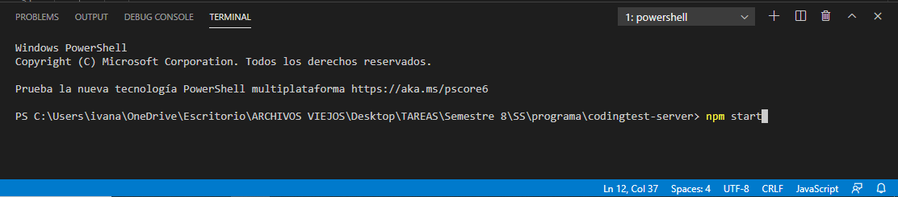

# Coding test

Coding test es un sistema enfocado en la evaluación de los códigos de los estudiantes que están en los primeros cursos de programación de las carreras de Ingeniería de Software, Ciencias de la Computación, Ingeniería en Computación u otra carrera que involucre el aprendizaje de la programación. También permite la gestión de las calificaciones obtenidas de los alumnos por parte del maestro.

## Dependencias

Este sistema utiliza las siguientes herramientas:

- **[API de omegaUp](https://github.com/omegaup/omegaup/wiki/REST-API)**: [omegaUp](https://omegaup.com) es una plataforma en línea en donde los estudiantes pueden mejorar sus habilidades de ingeniería de software a través de ejercicios y  otras competencias. El [API de omegaUp](https://github.com/omegaup/omegaup/wiki/REST-API) es utilizada por este sistema para la creación de los ejercicios y para la evaluación de los mismos.
- **[GitHub Classroom](https://classroom.github.com)**: es una herramienta de gestión y manejo que utiliza la API de GitHub para habilitar el flujo de trabajo de GitHub para la educación. Esta herramienta es utilizada por el sistema para la obtención de los códigos del repositorio del maestro el cual contiene el código recibido de los estudiantes para luego ser calificados mediante el API de omegaUp.

## Instrucciones de uso

### Instalación

La aplicación está hecha en **[NodeJS](https://nodejs.org/es/)**. También es necesario instalar **[MongoDB](https://docs.mongodb.com/manual/)**.

### Comandos

Para correr el servidor de **Coding test**, se entra a la consola del ambiente de desarrollo y se introduce el siguiente comando: 

```
npm start
```



Una vez encendido el servidor, puede utilizarse un programa para realizar las peticiones de la API (como **[Postman](https://www.postman.com)**) mostradas en la siguiente sección.

## API
Para el uso de la API es requerido poner de prefijo ```http://localhost:3700/classroom```. Por ejemplo:
```http://localhost:3700/classroom/problem/:student/:organization/:assignment```

### GET ```/problem/:student/:organization/:assignment```

#### Descripción
Obtiene los detalles de la tarea asignada.

#### Privilegios
El usuario necesita estar loggeado.

#### Parámetros
| Parámetro | Tipo   | Descripción |
| ------ |---------| :------|
| ```student``` | string | Nombre del estudiante registrado en GitHub Classroom. |
| ```organization```  | string | Nombre de la organización registrada en GitHub Classroom. |
| ```assignment``` | string | Nombre de la tarea registrada en GitHub Classroom. |

#### Regresa
| Parámetro | Tipo   | Descripción |
| ------ |---------| :------|
| ```instructions``` | string | Instrucciones del tarea asignada. |


### GET ```/calification/:organization/:assignment/:student/:problemAlias/:language/:executionTime```

#### Descripción
Obtiene la última calificación obtenida de la 

#### Privilegios
El usuario necesita estar loggeado.

#### Parámetros
| Parámetro | Tipo   | Descripción |
| ------ |---------| :------|
| ```organization``` | string | Nombre de la organización registrada en GitHub Classroom. |
| ```assignment```  | string | Nombre de la tarea registrada en la clase de GitHub Classroom. |
| ```student``` | string | Nombre del estudiante registrado en GitHub Classroom. |
| ```problemAlias``` | string | Nombre del problema en omegaUp. |
| ```language``` | string | Lenguaje en el que fue hecho el código de la tarea. |
| ```executionTime``` | int | Tiempo de demora máximo para ser ejecutado el código. |

#### Regresa
| Parámetro | Tipo   | Descripción |
| ------ |---------| :------|
| ```score``` | double | Puntuación obtenida de la tarea enviada. |

### POST ```/create-problem``` (no terminado)

#### Descripción
Crea un problema en la plataforma omegaUp.

#### Privilegios
El usuario necesita estar loggeado.

#### Parámetros
| Parámetro | Tipo   | Descripción |
| ------ |---------| :------|
| ```authorUsername``` | string | Nombre de usuario del autor del problema. |
| ```title```  | string | Título del problema. |
| ```alias``` | string | Alias del problema. |
| ```source```  | string | Fuente del problema (UVA, OMI, etc...).|
| ```isPublic``` | string | ```0``` si el problema es privado. ```1``` si el problema es público. |
| ```validator```  | string | Define cómo se compararán las salidas de los concursatnes con las salidas oficiales. Los valores pueden ser: ```literal```, ```token```, ```token-caseless```, o ```token-numeric```|
| ```timeLimit``` | int | Límite de tiempo de ejecución para cada caso del problema en milisegundos. |
| ```problemContents```  | File | Archivo que contiene los detalles de problema. [Cómo escribir problemas para omegaUp](https://github.com/omegaup/omegaup/wiki/Cómo-escribir-problemas-para-Omegaup)|

#### Regresa
| Parámetro | Tipo   | Descripción |
| ------ |---------| :------|
| ```status``` | String | Estado obtenido de la petición. |
| ```uploaded_files```  | String | Arreglo de los archivos que fueron enviados. |

## Continuación del proyecto (OnBoarding)

Uno de los problemas que se tuvo en el desarrollo del proyecto fue el de crear problemas para la plataforma en omegaUp desde nuestra API. El objetivo es poder enviar un archivo *.zip* (recibido en el parámetro ```problemContents``` de ```/create-problem```) a través de la API, lo cual se intentó realizar mediante un POST con tipo de contenido ```multipart/formdata```.

Para ver más detalles puede revisar el [Reporte del proyecto](https://github.com/Ivan12273/codingtest-server/blob/master/Reporte%20del%20proyecto%20_Coding%20Test_.pdf).

Para dudas y aclaraciones de los avances puede consultar a los desarrolladores por medio de los correos: d-alvarez1@live.com.mx y i
