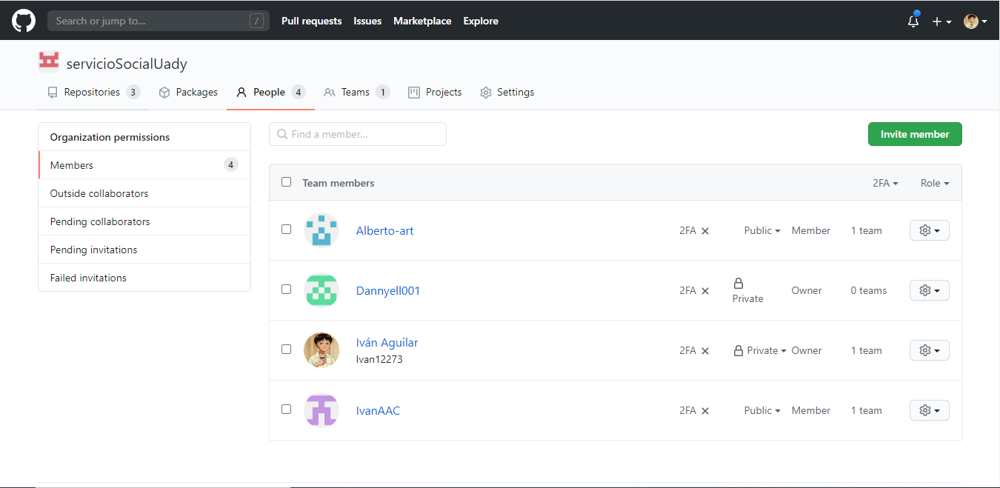
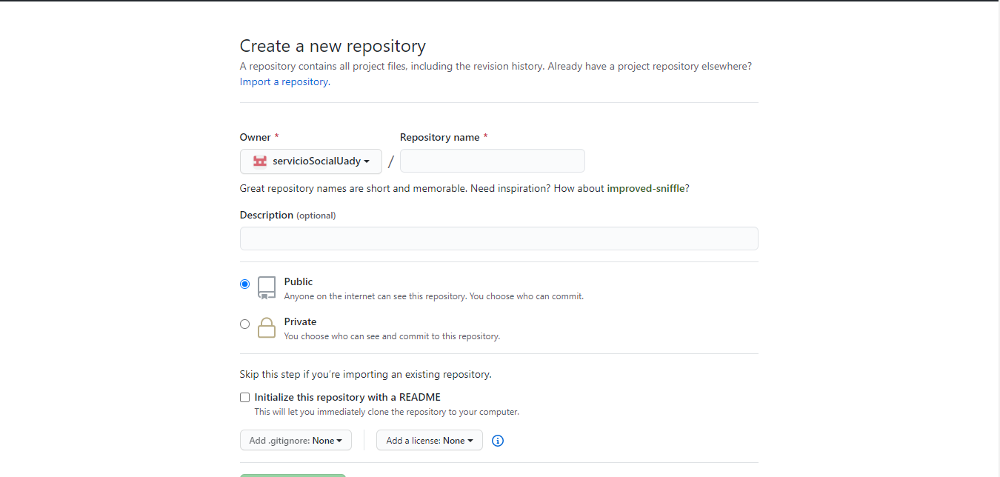
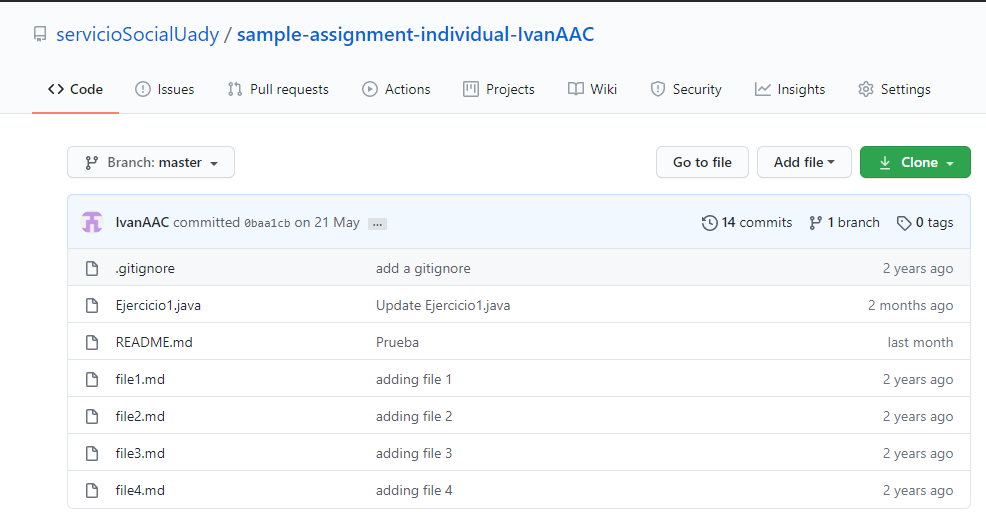
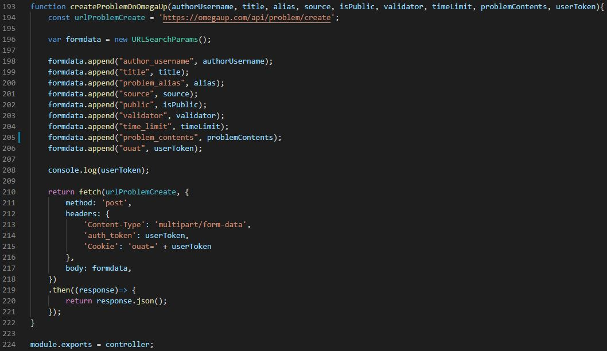

# Coding test

Coding test es un sistema enfocado en la evaluación de los códigos de los estudiantes que están en los primeros cursos de programación de las carreras de Ingeniería de Software, Ciencias de la Computación, Ingeniería en Computación u otra carrera que involucre el aprendizaje de la programación. También permite la gestión de las calificaciones obtenidas de los alumnos por parte del maestro.

## Tabla de contenidos

- [Dependencias](#dependencias)
- [Instrucciones de uso](#instrucciones-de-uso)
    - [Instalación](#instalación)
    - [Preparaciones previas](#preparaciones-previas)
    - [Comandos](#comandos)
- [API](#api)
- [Opciones de continuación del proyecto](#opciones-de-continuación-del-proyecto)
    - [Continuar desarrollando la API Coding Test](#continuar-desarrollando-la-api-coding-test)
    - [Continuar el proyecto con el autograding de GitHub Classroom](#continuar-el-proyecto-con-el-autograding-de-github-classroom)
    - [Continuar con otro proyecto con la información recopilada](#continuar-con-otro-proyecto-con-la-información-recopilada)

## Dependencias
Este sistema utiliza las siguientes herramientas:

- **[API de omegaUp](https://github.com/omegaup/omegaup/wiki/REST-API)**: [omegaUp](https://omegaup.com) es una plataforma en línea en donde los estudiantes pueden mejorar sus habilidades de ingeniería de software a través de ejercicios y  otras competencias. El [API de omegaUp](https://github.com/omegaup/omegaup/wiki/REST-API) es utilizada por este sistema para la creación de los ejercicios y para la evaluación de los mismos.
- **[GitHub Classroom](https://classroom.github.com)**: es una herramienta de gestión y manejo que utiliza la [API de GitHub](https://developer.github.com/v3/) para habilitar el flujo de trabajo de GitHub para la educación. Esta herramienta es utilizada por el sistema para la obtención de los códigos del repositorio del maestro el cual contiene el código recibido de los estudiantes para luego ser calificados mediante el API de omegaUp.

## Instrucciones de uso

### Instalación

La aplicación está hecha en **[NodeJS](https://nodejs.org/es/)**. También es necesario instalar **[MongoDB](https://docs.mongodb.com/manual/)**.

### Preparaciones previas

Para las pruebas, crea tu propia classroom, en nuestro caso es "servicioSocialUady", y pon a los miembros con los que vayas a hacer pruebas como "public".



De igual forma, el repositorio en el que vayas a subir el ejercicio, debe estar como "public".



Y finalmente sube tu código al repositorio, en nuestro caso es "Ejercicio1.java". Nota: En el caso de Java, omegaUp solo acepta que la clase esté nombrada como "Main".



ADVERTENCIA: Esto se hizo con el fin de hacer pruebas, la visibilidad tanto de los usuarios como de los repositorios deberían ser privadas, esto no pudo desarrollarse así por falta de tiempo. Para más información sobre cómo acceder a repositorios privados investigar sobre "GitHub API authentication". Se planeó utilizar esta libreria para dar solución a este caso: https://github.com/octokit/auth.js/

### Comandos

Para correr el servidor de **Coding test**, se entra a la consola del ambiente de desarrollo y dentro de la carpeta del proyecto se introduce el siguiente comando: 

```
npm start
```


Una vez encendido el servidor, puede utilizarse un programa para realizar las peticiones de la API (como **[Postman](https://www.postman.com)**) mostradas en la siguiente sección.

## API
Para el uso de la API es requerido poner de prefijo ```http://localhost:3700/classroom```. Por ejemplo:
```http://localhost:3700/classroom/problem/:student/:organization/:assignment```

### GET ```/problem/:student/:organization/:assignment```

#### Descripción
Obtiene los detalles de la tarea asignada.

#### Privilegios
El usuario necesita estar loggeado.

#### Parámetros
| Parámetro | Tipo   | Descripción |
| ------ |---------| :------|
| ```student``` | string | Nombre del estudiante registrado en GitHub Classroom. |
| ```organization```  | string | Nombre de la organización registrada en GitHub Classroom. |
| ```assignment``` | string | Nombre de la tarea registrada en GitHub Classroom. |

#### Regresa
| Parámetro | Tipo   | Descripción |
| ------ |---------| :------|
| ```instructions``` | string | Instrucciones del tarea asignada. |


### GET ```/calification/:organization/:assignment/:student/:problemAlias/:language/:executionTime```

#### Descripción
Envía el código desde el repositorio de GitHub Classroom al problema de omegaUp.

#### Privilegios
El usuario necesita estar loggeado.

#### Parámetros
| Parámetro | Tipo   | Descripción |
| ------ |---------| :------|
| ```organization``` | string | Nombre de la organización registrada en GitHub Classroom. |
| ```assignment```  | string | Nombre de la tarea registrada en la clase de GitHub Classroom. |
| ```student``` | string | Nombre del estudiante registrado en GitHub Classroom. |
| ```problemAlias``` | string | Nombre del problema en omegaUp. |
| ```language``` | string | Lenguaje en el que fue hecho el código de la tarea. |
| ```executionTime``` | int | Tiempo de demora máximo para ser ejecutado el código. |

#### Regresa
| Parámetro | Tipo   | Descripción |
| ------ |---------| :------|
| ```score``` | double | Puntuación obtenida de la tarea enviada. |

### POST ```/create-problem``` (no terminado)

#### Descripción
Crea un problema en la plataforma omegaUp.

#### Privilegios
El usuario necesita estar loggeado.

#### Parámetros
| Parámetro | Tipo   | Descripción |
| ------ |---------| :------|
| ```authorUsername``` | string | Nombre de usuario del autor del problema. |
| ```title```  | string | Título del problema. |
| ```alias``` | string | Alias del problema. |
| ```source```  | string | Fuente del problema (UVA, OMI, etc...).|
| ```isPublic``` | string | ```0``` si el problema es privado. ```1``` si el problema es público. |
| ```validator```  | string | Define cómo se compararán las salidas de los concursatnes con las salidas oficiales. Los valores pueden ser: ```literal```, ```token```, ```token-caseless```, o ```token-numeric```|
| ```timeLimit``` | int | Límite de tiempo de ejecución para cada caso del problema en milisegundos. |
| ```problemContents```  | File | Archivo que contiene los detalles de problema. [Cómo escribir problemas para omegaUp](https://github.com/omegaup/omegaup/wiki/Cómo-escribir-problemas-para-Omegaup)|

#### Regresa
| Parámetro | Tipo   | Descripción |
| ------ |---------| :------|
| ```status``` | String | Estado obtenido de la petición. |
| ```uploaded_files```  | String | Arreglo de los archivos que fueron enviados. |

## Opciones de continuación del proyecto

Las opciones que consideramos son las siguientes:
- [Continuar desarrollando la API Coding Test](#continuar-desarrollando-la-api-coding-test)
- [Continuar el proyecto con el autograding de GitHub Classroom](#continuar-el-proyecto-con-el-autograding-de-github-classroom)
- [Continuar con otro proyecto con la información recopilada](#continuar-con-otro-proyecto-con-la-información-recopilada)

### Continuar desarrollando la API Coding Test
Continuar con el proyecto tendría como beneficio que se cumplan la mayor parte de los requerimientos para este proyecto, ya que podría irse adaptando para cumplir con las necesidades de la institución. Sin embargo, hay una serie de ventajas y desventajas que habría que tomar en cuenta, estas se presentan a continuación:

- **Ventajas**
    - Como es un API propio, pueden añadirse y cambiarse funciones, se puede personalizar para adaptarse a las necesidades de los profesores de nuestra facultad.
    - OmegaUp como herramienta para testing, es superior por el momento al autograding, tiene más funciones y permite más personalización en los problemas.
    - OmegaUp tiene soporte para más lenguajes que el autograding.
    - OmegaUp es un sistema terminado, mientras que el autograding sigue en fase de pruebas y aún pueden surgir errores.
    - El sistema está documentado y explicado, se tiene conocimiento de las peticiones más importantes de OmegaUp que utiliza el sistema.
    - La función que conecta a OmegaUp y GitHub para testear un código funciona y está casi completa, falta el detalle de que al usar el api de GitHub pueda funcionar con un           repositorio privado.
    
- **Desventajas**
    - Depende del api de GitHub y de OmegaUp.
    - Poca documentación del api de OmegaUp.
    - Al ser un API enfocada a los concursos, por su propia naturaleza la forma de acceder a ciertos datos (como la calificación del alumno) es más complicada de lo que               debería ser para el uso que le queremos dar.
    - Siguiendo lo anterior, para obtener la calificación de un alumno, se necesita esperar cierto tiempo para que OmegaUp compile el ejercicio y devuelva el resultado más             actualizado, de no ser así, devolverá el resultado anterior o no devolverá nada si no existen resultados previos (todo esto ya fue programado, sin embargo, es un                 detalle importante para tener en cuenta). 
    - A pesar de que varios de las complicaciones con el api de OmegaUp fueron resueltas (para la función de testear un código), aún hay otras complicaciones para la                   creación de un problema en OmegaUp.

Uno de los problemas que se tuvo en el desarrollo del proyecto fue el de crear problemas para la plataforma en omegaUp desde nuestra API. El objetivo es poder enviar un archivo *.zip* (recibido en el parámetro ```problemContents``` de ```/create-problem```) a través de la API, lo cual se intentó realizar mediante un POST con tipo de contenido ```multipart/formdata```.



Una vez logrado lo anterior, se puede actualizar el GET ```/calification/:organization/:assignment/:student/:problemAlias/:language/:executionTime``` que toma como modelo el método del API de omegaUp de ```https://omegaup.com/api/run/create``` cuyos parámetros son los siguientes:

| Parámetro | Tipo   | Descripción |
| ------ |---------| :------|
| ```problem_alias``` | String | Alias del problema. |
| ```language```  | String | Lenguaje de programación con el que se desarrollo la solución. *Ver tabla de lenguajes permitidos*.|
| ```sorce```  | String | Código del programa |

Para el campo ```language``` se aceptan los siguientes valores:
| Valor | Lenguaje |
| ------ |---------|
| kp | Karel (Pascal) |
| kj | Karel (Java) |
| c | C11 (gcc 7.4) |
| c11-gcc | C11 (gcc 7.4) |
| c11-clang | C11 (clang 6.0) |
| cpp | C++03 (g++ 7.4) |
| cpp11 | C++11 (g++ 7.4) |
| cpp11-gcc | C++11 (g++ 7.4) |
| cpp11-clang | C++11 (clang++ 6.0) |
| cpp17-gcc | C++17 (g++ 7.4) |
| cpp17-clang | C++17 (clang++ 6.0) |
| java | Java (openjdk 11.0) |
| py | Python 2.7 |
| py2 | Python 2.7 |
| py3 | Python 3.6 |
| rb | Ruby (2.5) |
| pl | Perl (5.26) |
| cs | C# (dotnet 2.2) |
| pas | Pascal (fpc 3.0) |
| cat | Output Only |
| hs | Haskell (ghc 8.0) |
| lua | Lua (5.2) |

La actualización podría implementar un código más dinámico que permita recibir el nombre de usuario y la contraseña para poder iniciar sesión en GitHub Classroom para la obtención del código, y en omegaUp para el envío del código.

### Continuar el proyecto con el autograding de GitHub Classroom 
Al momento de iniciar con el proyecto,el autograding de GitHub Classroom todavía no estaba implementado, por lo que podría ser una alternativa a seguir en dado caso que ese sistema cumpla con los requerimientos del proyecto. Al igual que con la opción anterior, tiene sus ventajas y desventajas que identificamos:

- **Ventajas**
    - Tiene autograding que permite hacer pruebas unitarias del código de los alumnos.
    - Está enlazado con GitHub para acceder a los repositorios de los estudiantes.
    - Tiene más documentación que omegaUp.
    - La complejidad del sistema disminuiría dado que no se necesitaría utilizar omegaUp.
    
- **Desventajas**
    - Se hace un repositorio por cada tarea que se establece, lo que puede llevar a tener una cantidad muy grande de estos, por lo que una buena organización y buen uso de las herramientas de gestión es necesaria.
    - No están disponibles los cambios del repositorio original a los nuevos repositorios creados por los estudiantes para hacer la tarea.
    

### Continuar con otro proyecto con la información recopilada
Otra opción sería usar la información recopilada y parte del código de Coding Test para trasladarlas a un nuevo proyecto que sea una extensión para Visual Studio Code.
